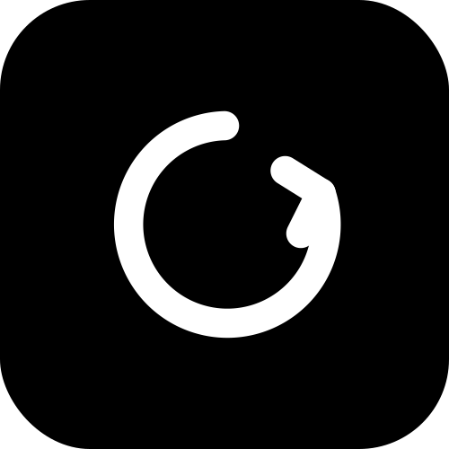

# Resonance.io (v0.2.1)

<div align="center">
  

  <h1>RESONANCE</h1>
  <p><strong>Your music · your mood</strong></p>
  <p><em>An institutional-grade ecosystem integrating predictive AI analytics, real-time sync engines, and immersive interfaces.</em></p>
</div>

---

Resonance is architected for modular distribution, cross-platform playback, and seamless integration with modern music infrastructure.

## 🌐 Ecosystem Architecture

The Resonance platform is broken down into highly specialized sub-systems to maintain separation of concerns, rapid testability, and isolated deployment vectors:

```
resonance.io/
├── core/              # AI & Analytics Engine
├── sync/              # Real-time Synchronization
├── frontend/          # Web UI (React)
├── mobile/            # iOS/Android Apps
└── api/               # REST & WebSocket APIs
```

### Core Modules

- **predictive-ai**: Machine learning models for mood detection and recommendations
- **sync-engine**: Real-time state synchronization across devices
- **audio-processor**: Advanced audio analysis and DSP
- **playback-manager**: Cross-platform media control

## 🚀 Quick Start

### Prerequisites
- Node.js 16+
- Python 3.8+
- Docker (optional)

### Installation

```bash
git clone https://github.com/ubayanda563/resonance.io.0.2.1.git
cd resonance.io.0.2.1

# Install frontend dependencies
cd frontend
npm install
npm start

# In another terminal, start backend services
cd ../backend
pip install -r requirements.txt
python manage.py runserver
```

## 📚 Documentation

- [Architecture Guide](./docs/architecture.md)
- [API Reference](./docs/api.md)
- [Development Setup](./docs/setup.md)

## 🤝 Contributing

We welcome contributions! Please see [CONTRIBUTING.md](./CONTRIBUTING.md) for guidelines.

## 📄 License

MIT License - see [LICENSE](./LICENSE) for details.

---

**Built with passion for music lovers worldwide** 🎵
